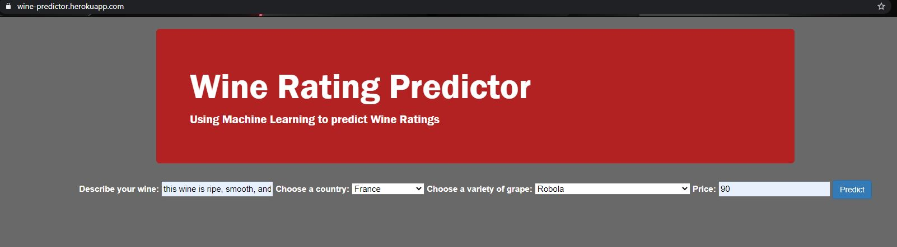
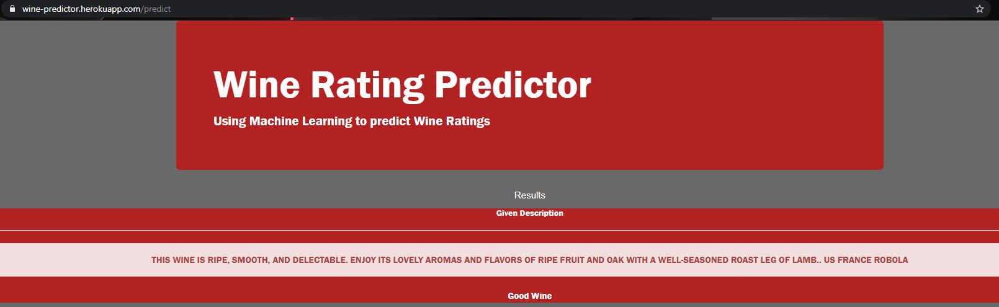

# Wine-Predictions
The goal of this project was predicting the rating of wine based on various factors. This was done using machine learning model that could look at features such as a review/ description, origin, variety, and price and use these features to make a prediction based on a previously trained dataset.\
The data set we trained our machine learning model on can be found at https://www.kaggle.com/zynicide/wine-reviews.\
A count vectorizor in the scikit-learn library was our primary tool used to create the model.
# Deployed live at: https://wine-predictor.herokuapp.com/

The interface\

The output page\

